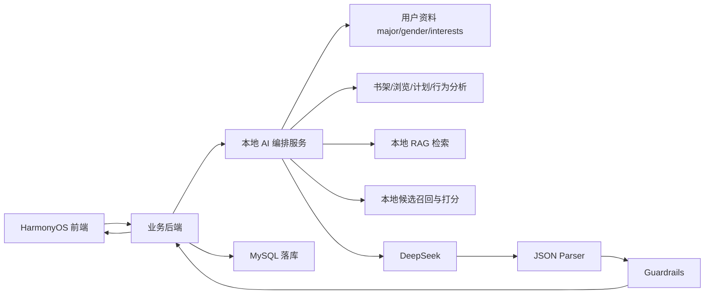

# 鸿蒙智阅 AI 开发说明

## 1. 目标

本文件用于指导鸿蒙智阅的 AI 推荐与伴读问答开发。AI 能力必须服务于项目主闭环：

```text
搜索图书 -> 图书详情 -> AI 推荐/伴读 -> 阅读器正文 -> 计划/笔记/收藏 -> 渠道检索/确认 -> 画像与历史回写
```

核心原则：

- AI 不做泛化聊天助手，只围绕找书、读书、提问、计划、笔记和渠道辅助工作。
- 推荐和问答必须基于真实后端数据、RAG 片段、用户行为和用户资料，不能依赖前端假数据。
- DeepSeek 负责语言理解、结构化生成、解释和适度推理；本地服务负责候选召回、规则打分、RAG 检索、来源校验、输出解析和落库。
- 每次推荐和问答都必须可追溯：知道用了哪些用户数据、哪些书籍候选、哪些来源片段、哪个模型和哪个 prompt 版本。

## 2. 用户资料字段约束

用户资料只保留三个推荐边界字段：

```json
{
  "major": "专业",
  "gender": "性别",
  "interests": "兴趣"
}
```

字段含义：

- `major`：专业方向，用于约束学科范围、术语难度、入门路径和扩展阅读方向。
- `gender`：性别，只作为用户主动填写的弱约束，不得用于判断学习能力、阅读难度、专业适配度或资源优先级。
- `interests`：兴趣标签，用于捕捉非专业阅读偏好，例如人工智能、文学、心理学、考研、竞赛、英语等。

开发约束：

- 推荐排序中，`major` 和 `interests` 可以作为强信号。
- `gender` 只能作为弱信号，且不得产生刻板印象推荐。
- 不再把年级、目标、预算、渠道偏好作为用户资料核心字段；这些内容若需要使用，应从阅读计划、行为分析、渠道选择记录等业务数据中推断或读取。
- 前端、后端、AI 服务需要逐步对齐 `UserProfile` 字段，避免继续把 `grade`、`goal`、`budget`、`channels` 当作 AI 推荐核心输入。

## 3. AI 总体架构

推荐和问答采用“本地可信控制 + DeepSeek 结构化生成”的方式。



分工：

- 前端：展示、输入、加载态、错误态、用户确认。
- 后端：鉴权、参数校验、统一响应包、行为落库、写操作确认、调用 AI 服务。
- 本地 AI 编排服务：意图识别、上下文组装、候选召回、RAG 检索、规则打分、prompt 组装、DeepSeek 调用、输出解析、降级处理。
- DeepSeek：基于输入上下文生成推荐解释、伴读回答、摘要、下一步建议和结构化 JSON。
- MySQL：保存用户资料、书籍、书架、浏览、计划、笔记、收藏、问答、推荐记录、行为事件和来源片段。

## 4. 可用上下文

AI 推荐和问答可以使用以下真实数据：

- 用户资料：`major`、`gender`、`interests`。
- 书架：收藏、已加入书架、已读、在读、放弃、用户导入书。
- 浏览记录：搜索词、标签点击、详情页浏览、停留时长、重复访问。
- 阅读计划：计划中的书、目标天数、每日/每周阅读时长、进度、当前章节、完成状态。
- 行为分析：收藏、加入计划、保存笔记、提问、点击渠道、确认借阅/购买、阅读时长、章节进度。
- 图书数据：标题、作者、标签、简介、难度、适读人群、章节目录、章节摘要、正文片段。
- RAG 来源：`book_chunk`、章节正文、章节摘要、笔记片段、历史问答中可追溯内容。

禁止使用：

- 前端硬编码推荐结果。
- 未入库、不可追溯的书名、作者、库存、章节内容。
- DeepSeek 自己“记得”的图书事实来替代项目数据库。
- 无用户确认的购买、借阅、预约、计划写入。

## 5. 推荐链路

推荐不是直接问 DeepSeek “推荐几本书”，而是先由本地服务召回和排序，再让 DeepSeek 解释。

```text
query + 用户资料 + 书架 + 浏览记录 + 阅读计划 + 行为分析
-> intent_router
-> candidate_recall
-> RAG 检索候选书证据
-> local_ranker 本地打分
-> DeepSeek 生成解释和下一步建议
-> output_parser
-> guardrails
-> save recommendation_record
-> frontend render
```

### 5.1 候选召回

候选书来源：

- 关键词搜索结果。
- 专业相关书籍。
- 兴趣标签匹配书籍。
- 与书架中高质量行为相关的同类书。
- 阅读计划中当前书的前置书、进阶书、同主题书。
- 最近浏览主题相关书。
- 用户导入且可阅读的本地书。

候选召回必须来自后端数据库或受控检索工具，不能由 DeepSeek 编造。

### 5.2 本地排序

建议先使用可解释规则打分，后续再引入学习排序模型。

推荐基础分：

```text
score =
  0.25 * 专业匹配度
+ 0.20 * 兴趣匹配度
+ 0.20 * 最近浏览/搜索匹配度
+ 0.15 * 阅读计划相关度
+ 0.10 * 书架正反馈相关度
+ 0.05 * 难度适配度
+ 0.05 * 来源证据质量
- 已读/放弃/重复推荐惩罚
- 资料不足惩罚
```

行为权重建议：

```text
加入阅读计划 > 收藏 > 保存笔记 > 提问 > 长停留浏览 > 普通点击 > 快速退出
```

行为解释：

- 加入计划说明用户有真实阅读意图。
- 收藏说明用户感兴趣但未必会读。
- 保存笔记说明内容对用户有价值。
- 提问说明用户正在理解或卡住。
- 长停留说明可能感兴趣。
- 快速退出或放弃计划是负反馈。

### 5.3 DeepSeek 在推荐中的作用

DeepSeek 输入应该包含：

- 用户资料摘要：专业、性别、兴趣。
- 行为摘要：近期搜索、浏览、书架、计划、笔记、问答等聚合信息。
- 候选书列表：只能传本地召回出的书。
- 每本候选书的证据片段。
- 本地打分和排序理由。
- 输出 JSON 约束。

DeepSeek 输出负责：

- 用自然中文解释为什么这些书适合当前用户。
- 给每本书生成具体、可信、不过度营销的推荐理由。
- 说明整体难度。
- 给出下一步阅读建议。
- 在证据不足时明确返回资料不足。

DeepSeek 不负责：

- 自己新增候选书。
- 自己决定库存或渠道。
- 自己写入计划、收藏、笔记或购买记录。
- 用模型记忆补齐缺失书籍事实。

### 5.4 推荐输出格式

`POST /ai/recommend` 的 `data` 至少返回：

```json
{
  "intent": "recommend",
  "book_list": [
    {
      "id": 1,
      "title": "书名",
      "author": "作者",
      "difficulty": "入门",
      "reason": "推荐理由",
      "score": 0.86
    }
  ],
  "reason": "整体推荐解释",
  "difficulty": "整体难度判断",
  "follow_up_suggestion": "下一步建议",
  "sources": [
    {
      "chunk_id": 11,
      "book_id": 1,
      "title": "来源标题",
      "source": "book_chunk",
      "text": "来源片段"
    }
  ],
  "llm_status": "ok"
}
```

`llm_status` 可选值建议：

- `ok`：正常。
- `insufficient_context`：资料不足。
- `partial`：有部分证据，但不能完整回答或推荐。
- `parser_failed`：模型输出无法解析。
- `guardrail_blocked`：命中安全或业务边界。
- `model_failed`：DeepSeek 调用失败。
- `fallback_local`：DeepSeek 不可用时使用本地规则结果。

## 6. 问答链路

伴读问答必须围绕指定图书和可追溯来源回答。

```text
book_id + question + chapter_id + 用户资料 + 阅读进度 + 历史问答
-> intent_router
-> RAG 检索当前图书/章节/片段
-> local_context_builder
-> DeepSeek 生成答案
-> output_parser
-> guardrails
-> save chat_record
-> frontend render answer + sources
```

### 6.1 问答意图

`intent_router` 至少区分：

- `book_chat`：围绕当前书问答。
- `chapter_summary`：章节摘要。
- `concept_explain`：概念解释。
- `reading_plan_advice`：阅读计划建议。
- `compare_books`：图书比较。
- `commerce_assist`：渠道辅助。
- `insufficient_context`：资料不足。
- `out_of_scope`：超出图书阅读场景。

### 6.2 DeepSeek 在问答中的作用

DeepSeek 可以用于：

- 把检索片段组织成清晰回答。
- 根据用户专业和兴趣调整解释方式。
- 用类比帮助理解概念。
- 生成下一步阅读或追问建议。
- 对章节内容做摘要、重点提炼和复习提示。

DeepSeek 不可以用于：

- 编造当前书没有的章节内容。
- 编造作者观点、原文、页码或来源。
- 无来源回答书籍事实。
- 把性别当作能力或兴趣判断依据。
- 自动替用户保存笔记、创建计划、购买或借阅。

### 6.3 问答输出格式

`POST /ai/chat` 的 `data` 至少返回：

```json
{
  "answer": "围绕当前图书和来源片段生成的回答",
  "sources": [
    {
      "chunk_id": 21,
      "book_id": 1,
      "title": "章节或片段标题",
      "source": "book_chunk",
      "text": "可追溯来源片段"
    }
  ],
  "follow_up_suggestion": "下一步阅读或提问建议",
  "llm_status": "ok"
}
```

资料不足时必须这样降级：

```json
{
  "answer": "当前资料不足，无法基于已收录片段可靠回答这个问题。",
  "sources": [],
  "follow_up_suggestion": "可以补充章节范围，或改问某一章的核心观点。",
  "llm_status": "insufficient_context"
}
```

## 7. 本地思考与 DeepSeek 的结合方式

这里的“本地思考”不是把模型的隐藏推理展示给用户，而是指 AI 服务在调用 DeepSeek 前后做可复现的本地分析。

### 7.1 调用前

本地服务先完成：

- 参数校验：用户、图书、章节是否存在。
- 意图初判：推荐、问答、摘要、计划、渠道或越界。
- 用户上下文摘要：专业、性别、兴趣、书架、浏览、计划、行为。
- 候选召回：只从真实接口和数据库取书。
- RAG 检索：只从可追溯片段取证据。
- 本地排序：生成候选分数和排序依据。
- Prompt 组装：只把必要上下文传给 DeepSeek，避免把无关隐私和长历史全部塞入模型。

### 7.2 调用 DeepSeek

建议封装统一客户端：

```text
DeepSeekClient.generate_json(
  model="deepseek-chat",
  prompt_version="recommend_v1/chat_v1",
  input=context,
  response_schema=schema,
  timeout=20s
)
```

调用规则：

- 推荐、问答默认要求 JSON 输出。
- 结构化 JSON、工具调用、schema 校验优先使用 `deepseek-chat`。
- `deepseek-reasoner` 可以作为可选的分析模型，但不作为结构化输出和工具调用主模型。
- 可以使用 DeepSeek 的 reasoning 能力辅助解释，但不得把原始隐藏推理作为业务事实或直接展示给用户。
- 前端最多展示“依据摘要”和“来源片段”，不要展示模型完整思考链。
- 如果 DeepSeek 返回非 JSON，必须进入 parser 降级流程。

### 7.3 调用后

本地服务继续完成：

- JSON 解析和 schema 校验。
- 来源校验：`sources` 必须对应真实 `chunk_id/book_id`。
- 候选校验：推荐书必须在候选召回集合内。
- 安全校验：不能越权、不能自动写操作、不能无来源编造。
- 状态标记：设置 `llm_status`。
- 落库：保存推荐记录、问答记录、模型名、prompt 版本、来源 ID、行为事件。

## 8. LangChain 使用规范

LangChain 在本项目中是 AI 编排层，不是业务后端，也不是数据库。它负责把本地上下文、RAG 来源、Prompt、DeepSeek 和结构化输出串起来。

官方参考：

- LangChain Python 总览：`https://docs.langchain.com/oss/python`
- LangChain RAG：`https://docs.langchain.com/oss/python/langchain/rag`
- DeepSeek 集成：`https://docs.langchain.com/oss/python/integrations/chat/deepseek/`
- `ChatDeepSeek.with_structured_output`：`https://reference.langchain.com/python/langchain-deepseek/chat_models/ChatDeepSeek/with_structured_output`

### 8.1 安装依赖

AI 服务建议独立放在 `ai-service/`，使用 Python + FastAPI + LangChain。

```bash
pip install -U fastapi uvicorn pydantic
pip install -U langchain langchain-core langchain-community langchain-deepseek
```

如果第一阶段先从 MySQL 取 `book_chunk` 做关键词/混合检索，可以暂时不引入向量库。后续需要语义检索时再加入：

```bash
pip install -U chromadb
```

### 8.2 推荐目录结构

```text
ai-service/
  app/
    main.py                # FastAPI 入口
    config.py              # DeepSeek key、模型名、超时等配置
    schemas.py             # Pydantic 输入/输出 schema
    deepseek_client.py     # ChatDeepSeek 初始化
    intent_router.py       # 意图识别
    retriever.py           # RAG 检索与来源封装
    ranker.py              # 本地候选排序
    recommend_chain.py     # 推荐链
    chat_chain.py          # 伴读问答链
    output_parser.py       # JSON 解析、schema 校验、降级
    guardrails.py          # 防编造、防越权、防刻板印象
    repository.py          # 调后端或数据库读取真实数据
  prompts/
    recommend_v1.md
    chat_v1.md
    summary_v1.md
    fallback_v1.md
```

### 8.3 初始化 DeepSeek

```python
from langchain_deepseek import ChatDeepSeek

def build_deepseek() -> ChatDeepSeek:
    return ChatDeepSeek(
        model="deepseek-chat",
        temperature=0.2,
        timeout=20,
        max_retries=2,
    )
```

规则：

- 推荐和问答的正式 JSON 输出使用 `deepseek-chat`。
- `temperature` 建议在 `0.1` 到 `0.3`，降低编造和格式漂移。
- API Key 只能放在环境变量或配置中心，不写入仓库。
- LangChain 返回的原始消息不直接给前端，必须经过 parser 和 guardrails。

### 8.4 Pydantic 结构化输出

推荐结果和问答结果都要先定义 Pydantic schema。

```python
from pydantic import BaseModel, Field
from typing import List

class SourceRef(BaseModel):
    chunk_id: int
    book_id: int
    title: str
    source: str
    text: str

class RecommendationBook(BaseModel):
    id: int
    title: str
    author: str = ""
    difficulty: str = ""
    reason: str = ""
    score: float = 0

class RecommendResult(BaseModel):
    intent: str = Field(default="recommend")
    book_list: List[RecommendationBook]
    reason: str
    difficulty: str
    follow_up_suggestion: str
    sources: List[SourceRef]
    llm_status: str = Field(default="ok")

class ChatResult(BaseModel):
    answer: str
    sources: List[SourceRef]
    follow_up_suggestion: str
    llm_status: str = Field(default="ok")
```

LangChain 调用方式：

```python
from langchain_core.prompts import ChatPromptTemplate

llm = build_deepseek()
structured_llm = llm.with_structured_output(
    RecommendResult,
    method="json_mode",
    include_raw=False,
)

prompt = ChatPromptTemplate.from_messages([
    ("system", "你是鸿蒙智阅的图书推荐助手。只能基于候选书和来源片段输出 JSON。"),
    ("human", "{context}")
])

chain = prompt | structured_llm
result: RecommendResult = chain.invoke({"context": context_text})
```

实现要求：

- `with_structured_output` 可以提升稳定性，但不能替代本地 parser。
- `include_raw=True` 可用于调试，生产接口不要把 raw 直接返回前端。
- 解析失败时进入 `output_parser.py` 降级，返回 `parser_failed` 或 `fallback_local`。

### 8.5 RAG 检索接入

第一阶段建议先把后端或数据库返回的 `book_chunk` 封装成 LangChain `Document`，不要为了使用 LangChain 而绕过现有数据契约。

```python
from langchain_core.documents import Document

def chunks_to_documents(chunks: list[dict]) -> list[Document]:
    return [
        Document(
            page_content=chunk["text"],
            metadata={
                "chunk_id": chunk["id"],
                "book_id": chunk["book_id"],
                "title": chunk.get("title", ""),
                "source": chunk.get("source", "book_chunk"),
            },
        )
        for chunk in chunks
    ]
```

伴读问答检索规则：

- 有 `book_id` 时，检索范围必须限制在当前书。
- 有 `chapter_id` 时，优先检索当前章节。
- 来源片段不足时返回 `insufficient_context`，不要让 DeepSeek 补事实。
- `Document.metadata` 必须能还原为前端的 `SourceRef`。

推荐检索规则：

- 先由后端召回候选书。
- 再按候选书检索简介、标签、章节摘要、知识片段。
- DeepSeek 只能解释候选书，不能新增候选书。

### 8.6 推荐 Chain

`recommend_chain.py` 应该接收后端整理好的上下文，而不是自己去猜用户。

```python
from langchain_core.prompts import ChatPromptTemplate

RECOMMEND_PROMPT = ChatPromptTemplate.from_messages([
    ("system", """
你是鸿蒙智阅的推荐助手。
只能从候选书中推荐，不能新增书名。
用户资料只有专业、性别、兴趣；性别不得用于能力和难度判断。
资料不足时返回 insufficient_context。
输出必须符合 RecommendResult JSON。
"""),
    ("human", """
用户资料：
{profile}

行为摘要：
{behavior_summary}

候选书和本地排序：
{ranked_candidates}

来源片段：
{sources}

用户需求：
{query}
""")
])

def build_recommend_chain(llm):
    return RECOMMEND_PROMPT | llm.with_structured_output(
        RecommendResult,
        method="json_mode",
    )
```

调用前必须由本地服务完成：

- 读取用户资料 `major/gender/interests`。
- 汇总书架、浏览记录、阅读计划、行为分析。
- 召回候选书。
- RAG 检索候选书来源。
- 规则打分并生成 `ranked_candidates`。

调用后必须校验：

- `book_list.id` 必须在候选书 ID 集合内。
- `sources.chunk_id` 必须真实存在。
- `gender` 不得出现在刻板印象理由中。
- 不合格则降级为本地排序解释。

### 8.7 问答 Chain

```python
CHAT_PROMPT = ChatPromptTemplate.from_messages([
    ("system", """
你是鸿蒙智阅的伴读助手。
只能基于来源片段回答当前图书问题。
可以结合用户专业和兴趣调整解释方式。
性别不得用于能力判断。
如果来源不足，返回 insufficient_context。
输出必须符合 ChatResult JSON。
"""),
    ("human", """
当前图书：{book}
当前章节：{chapter}
用户资料：{profile}
用户问题：{question}

来源片段：
{sources}
""")
])

def build_chat_chain(llm):
    return CHAT_PROMPT | llm.with_structured_output(
        ChatResult,
        method="json_mode",
    )
```

调用前：

- 校验 `book_id` 是否存在。
- 按 `book_id/chapter_id/question` 检索来源片段。
- 汇总用户阅读进度、历史提问、笔记，但只传必要摘要。

调用后：

- 校验答案不能包含来源之外的书内事实。
- 校验 `sources` 属于当前图书。
- 保存 `chat_record`、`source_chunk_ids`、`model_name`、`prompt_version`、`llm_status`。

### 8.8 FastAPI 对接方式

HarmonyOS 前端不直接访问 LangChain 服务；业务后端调用 AI 服务，AI 服务再通过 LangChain 调 DeepSeek。

```python
from fastapi import FastAPI

app = FastAPI()
llm = build_deepseek()

@app.post("/ai/recommend")
def recommend(req: RecommendRequest) -> RecommendResult:
    context = build_recommend_context(req)
    result = build_recommend_chain(llm).invoke(context)
    return validate_recommend_result(result, context)

@app.post("/ai/chat")
def chat(req: ChatRequest) -> ChatResult:
    context = build_chat_context(req)
    result = build_chat_chain(llm).invoke(context)
    return validate_chat_result(result, context)
```

后端返回给前端时仍使用统一响应包：

```json
{
  "code": 0,
  "message": "ok",
  "data": {}
}
```

### 8.9 流式输出

若前端需要流式展示，LangChain 可使用 `.stream()` 或 `.astream()`，但最终仍必须返回一个完整 JSON 结果。

建议策略：

- 流式阶段只展示状态和答案草稿。
- 最后一帧必须是完整 `RecommendResult` 或 `ChatResult`。
- 如果流中断，返回 `model_failed` 或 `partial`，并保留已检索 sources。
- 不在流式内容中展示 DeepSeek 隐藏推理。

### 8.10 不建议使用 LangChain 的地方

- 不用 LangChain 直接写 MySQL 业务数据。
- 不用 LangChain memory 替代项目数据库记忆。
- 不让 Agent 自主决定购买、借阅、创建计划、保存笔记。
- 不让 Tool Calling 绕过后端鉴权和用户确认。
- 不把 `book_chunk` 之外的模型记忆当来源。

本项目中更稳的边界是：

```text
LangChain = Prompt + RAG + Model + Structured Output 编排
业务后端 = 鉴权 + 数据契约 + 落库 + 用户确认
本地规则 = 候选召回 + 排序 + guardrails + 降级
DeepSeek = 语言理解 + 解释 + JSON 生成
```

## 9. Prompt 设计原则

推荐 prompt 必须包含：

- 角色：大学生阅读推荐与伴读助手。
- 边界：只围绕书籍、阅读、计划、笔记、渠道。
- 输入：用户资料、行为摘要、候选书、来源片段、本地排序分。
- 规则：只能推荐候选书；资料不足必须说明；必须输出 JSON。
- 输出 schema。

问答 prompt 必须包含：

- 当前图书和章节上下文。
- 用户问题。
- 检索到的来源片段。
- 用户专业和兴趣，用于调整解释深度。
- 性别只能作为弱上下文，不得影响能力判断。
- 答案必须引用来源；无来源则降级。
- 输出 schema。

Prompt 需要版本化管理，例如：

```text
ai-service/prompts/recommend_v1.md
ai-service/prompts/chat_v1.md
ai-service/prompts/summary_v1.md
ai-service/prompts/fallback_v1.md
```

每次调用需记录 `prompt_version`。

## 10. 行为分析设计

建议后端沉淀统一行为事件：

```json
{
  "user_id": 10086,
  "event_type": "search|view_book|favorite|create_plan|update_progress|save_note|ask_ai|commerce_click|purchase_confirm",
  "book_id": 1,
  "chapter_id": "chapter-1",
  "keyword": "人工智能",
  "tag": "AI",
  "duration_seconds": 120,
  "progress": 0.35,
  "extra": {}
}
```

行为分析产物建议：

- `recent_keywords`：最近搜索词。
- `recent_tags`：最近高频标签。
- `positive_book_ids`：强正反馈图书。
- `negative_book_ids`：放弃或快速退出图书。
- `active_plan_book_ids`：当前计划中的书。
- `reading_level_hint`：由阅读进度、提问难度和笔记类型推断的阅读阶段。
- `topic_weights`：主题权重。

这些产物进入推荐和问答上下文，但不替代真实来源。

## 11. 数据表建议

推荐至少支持以下表或等价结构：

- `user_profile`：用户资料，只把 `major/gender/interests` 作为 AI 核心画像字段。
- `user_behavior_event`：原始行为事件。
- `user_book_state`：用户与图书关系，例如已收藏、计划中、阅读中、已读完、已放弃。
- `user_profile_analysis`：画像聚合结果。
- `recommend_record`：推荐输入摘要、候选书、排序分、来源、模型状态。
- `chat_record`：问题、答案、来源、模型状态。
- `book_chunk`：RAG 来源片段。
- `reading_plan`：计划和进度。
- `note`：笔记与来源。
- `favorite`：收藏。

`recommend_record` 建议字段：

```text
id, user_id, query, profile_snapshot, behavior_snapshot,
candidate_book_ids, ranked_book_ids, source_chunk_ids,
model_name, prompt_version, llm_status, created_at
```

`chat_record` 建议字段：

```text
id, user_id, book_id, chapter_id, question, answer,
source_chunk_ids, model_name, prompt_version, llm_status, created_at
```

## 12. 接口建议

业务接口仍保持前端通过后端调用，不让 HarmonyOS 直接调用 DeepSeek。

推荐：

```text
POST /ai/recommend
```

请求：

```json
{
  "user_id": 10086,
  "query": "我想找人工智能入门书",
  "response_mode": "stream_json_grounded",
  "require_sources": true
}
```

问答：

```text
POST /ai/chat
```

请求：

```json
{
  "user_id": 10086,
  "book_id": 1,
  "question": "这一章的核心观点是什么？",
  "chapter_id": "chapter-1",
  "require_sources": true
}
```

画像：

```text
GET /users/profile?userId={userId}
POST /users/profile
```

画像返回给 AI 的核心字段建议统一为：

```json
{
  "id": 10086,
  "major": "计算机科学",
  "gender": "female",
  "interests": "人工智能,算法,英语"
}
```

## 13. Guardrails

必须拦截：

- 无来源编造书籍事实。
- 推荐候选集之外的书，并假装来自数据库。
- 使用性别进行能力、智力、专业适配度推断。
- 自动购买、借阅、预约或创建计划。
- 泛聊扩散到项目无关内容。
- 输出非 JSON 或缺少必填字段。
- 来源 ID 不存在或不属于当前图书。
- 把 DeepSeek 原始隐藏推理当作前端展示内容。

允许降级：

- DeepSeek 失败时，返回本地排序结果和简短规则解释，`llm_status=fallback_local`。
- RAG 片段不足时，返回资料不足和补充关键词建议。
- 候选书不足时，返回可执行的搜索建议，不编造书。

## 14. 验收标准

推荐验收：

- 推荐书都来自真实接口或数据库。
- 推荐理由能对应用户资料、书架、浏览、计划或行为分析。
- 推荐结果包含来源片段或明确说明资料不足。
- 重复推荐、已放弃图书有惩罚。
- 加入计划、收藏、保存笔记后，下一轮推荐会发生可解释变化。

问答验收：

- 指定图书问答必须优先使用当前图书来源。
- 答案包含 `sources`。
- 资料不足时返回 `insufficient_context`。
- 问答记录能落库，并能被后续推荐和问答引用。
- 不展示 DeepSeek 原始隐藏推理，只展示最终答案、依据摘要和来源。

用户资料验收：

- AI 核心画像字段为 `major/gender/interests`。
- `major`、`interests` 对推荐有明确影响。
- `gender` 不产生刻板印象推荐，不影响难度和能力判断。

工程验收：

- 所有 AI 输出都经过 JSON parser。
- 所有写操作经过业务后端和用户动作确认。
- 每次 AI 调用记录 `model_name`、`prompt_version`、`llm_status`。
- 前端不硬编码核心推荐、问答、计划、笔记、收藏、正文和渠道结果。

## 15. 落地优先级

第一阶段：

- 对齐用户资料字段：`major/gender/interests`。
- 完成行为事件采集和 `user_book_state`。
- 推荐和问答输出统一 JSON。
- DeepSeek 调用后增加 parser 和 guardrails。

第二阶段：

- 上线本地候选召回和规则排序。
- 把书架、浏览记录、阅读计划、行为分析接入推荐上下文。
- 推荐记录和问答记录完整落库。

第三阶段：

- 上线混合 RAG 检索。
- Prompt 版本化。
- 根据反馈行为持续更新画像分析。

第四阶段：

- 建立评测集，自动测试推荐准确性、来源可追溯性、资料不足降级和性别字段使用边界。
- 逐步引入学习排序，但保留本地规则解释和兜底能力。
