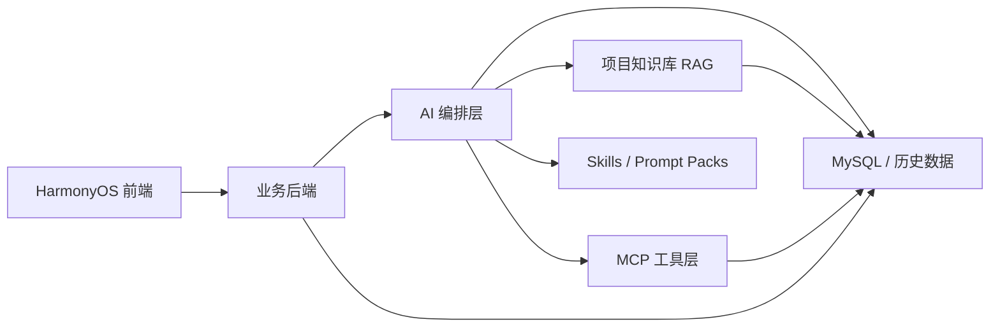

# AI 问答与 RAG 升级方案

## 目标
把鸿蒙智阅的 AI 能力做成“只围绕书做事”的阅读型智能体，而不是通用聊天机器人。

核心目标：
- 找书更准
- 推荐更像“懂你”
- 书籍问答尽量只基于项目知识库
- 收藏、计划、问答、笔记都能写库并可查询
- 每次回答都能追溯到具体书、章节、片段和历史行为

## 为什么能比同类 AI 更强
通用 AI 强在泛化，鸿蒙智阅要赢在“场景闭环”：

1. 它知道用户在读哪本书、读到哪一章、停在哪里。
2. 它知道用户收藏过什么、问过什么、记过什么、计划是什么。
3. 它只在项目知识库里找证据，不靠空口补全书籍事实。
4. 它的每个回答都能落回数据库，形成下一轮推荐和问答的上下文。
5. 它会给出下一步动作，而不是只给一段漂亮回答。

## 总体架构

分工原则：
- 前端只负责展示、输入、确认、加载和错误态
- 业务后端负责鉴权、校验、统一响应、落库
- AI 服务负责意图识别、RAG 检索、结构化输出、工具编排
- MySQL 负责所有历史、画像、笔记、计划、问答和回写数据

## AI 侧分层

### 1. 意图路由
先判断用户是在：
- 找书
- 推荐书
- 书籍问答
- 章节摘要
- 计划建议
- 渠道辅助
- 资料不足

对应现有 `intent_router`，但需要更细：
- 推荐意图优先走候选召回 + 重排
- 问答意图优先走书内证据
- 资料不足时必须明确返回 `insufficient_context`

### 2. RAG 检索
检索源不只是一张 `book_chunk` 表，而是整套项目知识库：
- `book`
- `book_chunk`
- `book_chapter`
- `chat_record`
- `note`
- `reading_plan`
- `user_question_analysis`
- `user_profile_analysis`
- `user_behavior_event`

检索策略建议：
- 先做 query expansion
- 再做关键词召回 + 语义召回
- 再按书相关性、章节相关性、历史相关性重排
- 最后做去重和证据压缩

回答规则：
- 有证据就引用证据
- 没证据就说资料不足
- 不补书名、不补章节、不补来源
- 不用常识冒充书内事实

### 3. 结构化输出
推荐和问答必须输出固定 JSON：
- `intent`
- `book_list`
- `reason`
- `difficulty`
- `follow_up_suggestion`
- `sources`
- `llm_status`

问答结果必须稳定包含：
- `answer`
- `sources`
- `follow_up_suggestion`
- `llm_status`

### 4. 历史记忆
每次 AI 行为都要写入历史：
- 推荐结果写入 `recommend_record`
- 问答记录写入 `chat_record`
- 问题分析写入 `user_question_analysis`
- 用户画像分析写入 `user_profile_analysis`
- 阅读行为写入 `user_behavior_event`
- 笔记写入 `note`
- 收藏写入 `favorite`
- 计划写入 `reading_plan`

这样下一次推荐和问答才有“读过的味道”。

## MCP 怎么用

MCP 适合把项目能力标准化成三类能力：

### Tools
适合做会触发动作的能力：
- `search_books`
- `get_book_detail`
- `list_chapters`
- `get_content`
- `save_note`
- `create_plan`
- `update_plan`
- `favorite`
- `track_event`

### Resources
适合做只读上下文：
- 图书详情
- 章节正文
- 用户画像
- 问答历史
- 笔记历史
- 计划历史
- 收藏历史

### Prompts
适合做可版本化的提示词资产：
- `recommend_book`
- `answer_about_book`
- `summarize_chapter`
- `compare_books`
- `explain_gap`

原则：
- 读操作可以直连检索层
- 写操作必须经后端校验和用户确认
- AI 服务不要直接绕过后端裸写业务数据

## Skills 怎么用

这里的 Skills 不是 Codex 技能本身，而是项目内可版本化的 AI 规则包。
建议放成独立文件，例如：
- `ai-service/skills/recommend_book_v1.md`
- `ai-service/skills/chat_book_v1.md`
- `ai-service/skills/source_citation_v1.md`
- `ai-service/skills/fallback_policy_v1.md`

每个 skill 包包含：
- 适用场景
- 输出格式
- 引用规则
- 不能做的事
- 失败降级策略
- 测试样例

这样 prompt、工具和 parser 都能版本化，不会靠一坨 system prompt 硬撑。

## 数据库设计

### 现有表要重点利用
- `recommend_record`
- `chat_record`
- `note`
- `favorite`
- `reading_plan`
- `user_question_analysis`
- `user_profile_analysis`
- `user_behavior_event`

### 建议补充字段
为了支持可查询历史和可追溯回答，建议补这些字段：

`chat_record`
- `session_id`
- `chapter_id`
- `source_chunk_ids`
- `retrieval_query`
- `model_name`
- `prompt_version`
- `llm_status`

`recommend_record`
- `candidate_book_ids`
- `retrieval_query`
- `prompt_version`
- `model_name`
- `llm_status`

`note`
- `source_chat_record_id`
- `source_chunk_id`
- `chapter_id`

`reading_plan`
- 保留 `chapter_id`、`scroll_offset`、`progress`
- 增强 `daily_minutes_target`、`weekly_minutes_target`

### 建议新增查询接口
- `GET /api/history?userId=&type=&bookId=&q=&page=`
- `GET /api/history/books/{bookId}`
- `GET /api/history/questions?userId=&bookId=`
- `GET /api/history/notes?userId=&bookId=`

这样前端可以直接做“我的历史”页，而不是只看零散列表。

## 业务闭环

### 找书
`query + user_profile + behavior_history -> intent_router -> candidate retrieval -> rerank -> recommend JSON -> save recommend_record -> frontend`

### 书籍问答
`book_id + question + chapter + retrieved chunks -> chat_chain -> parse -> save chat_record + question_analysis -> frontend`

### 计划和笔记
`user action -> backend validate -> persist -> update profile/history -> feed next recommendation`

### 继续读
`reading progress + plan state + chapter position -> reader bundle -> progress回写 -> next action suggestion`

## 现有代码应改哪里

### 后端
- `backend/src/main/java/com/hakimi/smartread/service/SmartReadService.java`
- `backend/src/main/java/com/hakimi/smartread/repository/SmartReadRepository.java`
- `backend/src/main/java/com/hakimi/smartread/controller/AiController.java`
- `backend/src/main/java/com/hakimi/smartread/controller/AnalyticsController.java`

重点改造：
- 推荐和问答输入补齐历史上下文
- 增强落库字段
- 新增历史查询接口
- 统一写操作鉴权和幂等

### AI 服务
- `ai-service/app/intent_router.py`
- `ai-service/app/rag.py`
- `ai-service/app/skills.py`
- `ai-service/app/output_parser.py`
- `ai-service/app/mcp_tools.py`

重点改造：
- RAG 从关键词检索升级为混合检索
- skills / prompt / parser 分层
- MCP tools 只暴露标准动作
- 输出严格 JSON，失败可降级但不可胡编

### HarmonyOS 前端
- `entry/src/main/ets/common/ApiClient.ets`
- `entry/src/main/ets/pages/SearchPage.ets`
- `entry/src/main/ets/pages/BookDetailPage.ets`
- `entry/src/main/ets/pages/ReaderPage.ets`
- `entry/src/main/ets/pages/PlanContent.ets`
- `entry/src/main/ets/pages/ProfileContent.ets`

重点改造：
- 展示来源片段
- 显示历史轨迹
- 显示“下一步建议”
- 收藏、计划、笔记、问答互相联动

## 评测标准

### 正确性
- 推荐结果是否和用户画像、历史行为一致
- 问答是否围绕图书资料回答
- 是否能在资料不足时明确降级

### 可追溯性
- 每个回答是否有 source
- source 是否能回到具体书和章节
- 是否能查到对应的 chat_record / recommend_record / note

### 闭环能力
- 收藏后是否影响下一轮推荐
- 计划后是否影响阅读入口
- 笔记后是否能进入历史和检索
- 问答后是否能沉淀为可查询历史

### 稳定性
- JSON 输出是否稳定
- parser 失败是否有降级
- 后端失败是否有可读错误

## 分阶段落地

### Phase 1
- 补齐历史写入和历史查询
- 统一推荐/问答输出格式
- 让所有回答带来源

### Phase 2
- 上线混合检索 RAG
- 接入 MCP tools/resources/prompts
- 引入 skills 版本化 prompt 包

### Phase 3
- 做历史驱动重排
- 做画像分析和阅读阶段分析
- 做评测集和自动回归

### Phase 4
- 前端把历史、计划、问答、笔记串成一个可回放的阅读时间线

## 最终目标
用户一旦用过鸿蒙智阅，就不是“问一下 AI”结束，而是：
- 找到合适的书
- 读进书里
- 记下自己真正关心的东西
- 下一次问答和推荐都比上一次更准

这才是这个项目真正的壁垒。
