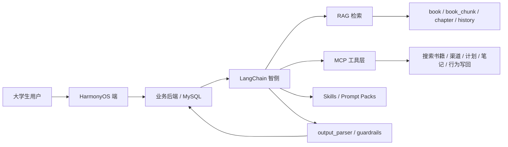
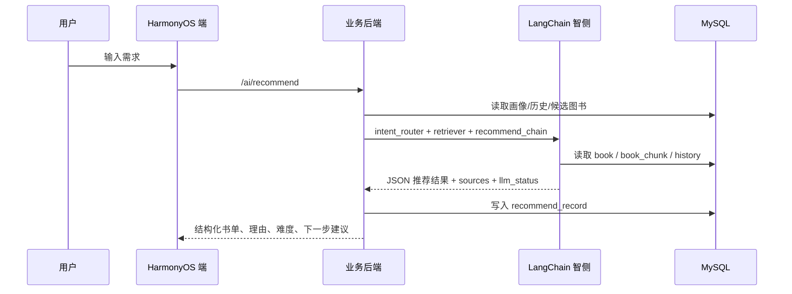

# 鸿蒙智阅 PRD 对齐版 AI 问答与知识闭环方案

> 这版不是泛化聊天方案，而是把“找书、读书、提问、计划、笔记、收藏、渠道确认、历史回写”做成一个可持续的书籍服务闭环。

## 1. 这版方案要解决什么

鸿蒙智阅要做的，不是再造一个普通聊天助手，也不是做一个图书馆管理系统，而是做一个面向大学生的“书籍场景智能体”。

核心目标只有四个：

1. 找书更准，能结合专业、年级、兴趣、目标、预算来解释推荐。
2. 伴读更准，回答尽量围绕项目知识库和当前图书资料，不漂到泛知识聊天。
3. 历史可查，收藏、计划、问答、笔记、画像、渠道确认都要沉淀到数据库。
4. 行为可续，前一次的阅读与提问，能真的影响下一次推荐与回答。

## 2. 为什么能比同类 AI 问答更强

相较通用大模型或普通图书问答产品，鸿蒙智阅的优势不在“会说”，而在“只围绕图书说、并且能继续做事”。

| 对比对象 | 本项目的优势 | 关键实现 |
|---|---|---|
| 通用 AI 问答 | 不做泛聊天，只围绕图书和阅读目标回答 | `user_profile + book + book_chunk + history -> RAG -> structured output` |
| 普通图书搜索 | 不只搜书名，还理解年级、兴趣、预算、目标 | 先判意图，再按画像、标签、章节摘要排序 |
| 普通推荐系统 | 推荐不是终点，能接着伴读、笔记、计划和渠道确认 | 收藏、问答、笔记、计划、确认全部写回数据库 |
| 同类阅读助手 | 输出可追溯、可评测、可回放、可回写 | LangChain + MCP + Skills + Harness + JSON Parser |

项目真正的竞争力是四个词：

- 场景封闭
- 证据可追溯
- 行为可回写
- 结果可继续驱动下一步动作

## 3. PRD 视角下的产品定位

鸿蒙智阅不是“聊天入口”，而是“大学生找书与伴读的入口”。

用户链路应始终保持为：

```text
搜索图书 -> 图书详情 -> AI 推荐/伴读 -> 阅读器正文 -> 计划/笔记/收藏 -> 渠道检索/确认 -> 画像与历史回写
```

只要某个能力不能回到这条链路里，它就不是核心能力。

## 4. 端 - 云 - 智 架构



### 端侧

- 负责展示、输入、加载态、错误态、用户确认。
- 负责把推荐、问答、来源片段、历史记录展示出来。
- 不写死核心答案，不直接拼业务逻辑。

### 云侧

- 负责统一 REST/JSON 接口。
- 负责参数校验、幂等、权限、写库、统一返回包。
- 负责把推荐、问答、计划、笔记、收藏、渠道确认、行为分析都落到数据库。

### 智侧

- 负责意图识别、RAG 检索、Prompt 组装、工具调用、结构化输出、失败降级。
- 负责只基于图书资料、用户画像、历史记录和允许的工具结果生成内容。
- 负责把“能回答”变成“能追溯、能保存、能继续做下一步”。

## 5. 现有工程对齐

### 端侧现状

现有代码里已经有较完整的前端骨架：

- `entry/src/main/ets/common/Models.ets`
- `entry/src/main/ets/common/ApiClient.ets`
- `entry/src/main/ets/pages/SearchPage.ets`
- `entry/src/main/ets/pages/BookDetailPage.ets`
- `entry/src/main/ets/pages/ReaderPage.ets`
- `entry/src/main/ets/pages/PlanContent.ets`
- `entry/src/main/ets/pages/ProfileContent.ets`
- `entry/src/main/ets/pages/ChatPage.ets`
- `entry/src/main/ets/pages/CommercePage.ets`

`ApiClient.ets` 已经覆盖了搜索、详情、伴读、推荐、计划、笔记、收藏、画像、渠道查询、购买确认、行为上报等主链路。

### 当前最值得补强的地方

1. 历史查询接口要更统一，最好能按用户、图书、类型、关键词查询。
2. 推荐和伴读记录要补足来源片段、检索查询、模型版本、解析状态。
3. RAG 不能只做关键词召回，要能混合图书资料、章节、问答历史、笔记和计划。
4. MCP/Skills 需要版本化，不要把所有能力塞进一个大 Prompt。
5. 渠道检索和购买/借阅确认必须保留用户确认动作，不能自动写成已完成。

## 6. 核心业务闭环

### 6.1 找书链路



### 6.2 伴读链路

```text
book_id + question + chapter context
  -> intent_router
  -> book-scope retriever
  -> chat_chain
  -> output_parser
  -> save chat_record
  -> frontend render sources
```

### 6.3 计划 / 笔记 / 收藏链路

```text
user action -> backend validate -> persist -> update profile/history -> feed next recommendation
```

### 6.4 渠道 / 购买确认链路

```text
book metadata -> commerce search -> compare channels -> user confirms -> purchase_record -> next action suggestion
```

关键原则只有一句：

> AI 可以建议、可以检索、可以生成草稿，但不能替用户自动确认购买、借阅、预约或写入已完成状态。

## 7. 页面设计对齐 PRD

| 页面 | 主要内容 | 关键操作 | 现有接口 |
|---|---|---|---|
| 首页 | 搜索入口、AI 推荐入口、最近阅读、推荐卡片 | 输入需求、继续阅读、进入详情 | `GET /books/search`，`POST /ai/recommend` |
| 搜索页 | 关键词、标签、结果列表 | 搜索、筛选、进入详情 | `GET /books/search` |
| 图书详情页 | 书名、作者、标签、简介、难度、适读人群 | 收藏、提问、加入计划、查看渠道 | `GET /books/{id}`，`POST /favorites`，`POST /plans` |
| AI 伴读页 | 问答气泡、来源片段、保存笔记 | 提问、保存、追问 | `POST /ai/chat`，`POST /notes` |
| 阅读器页 | 章节目录、正文、摘录、进度、来源 | 翻页、摘录、更新进度 | `GET /books/{id}/reader`，`PATCH /plans/{id}` |
| 阅读计划页 | 计划列表、目标天数、进度、状态 | 创建、更新、完成 | `GET /plans`，`POST /plans`，`PATCH /plans/{id}` |
| 我的画像页 | 专业、年级、兴趣、目标、预算、渠道偏好 | 修改画像、查看历史 | `GET/POST /users/profile` |
| 购书 / 馆藏页 | 电商、馆藏、二手书、库存、价格 | 排序、确认、预约、跳转 | `POST /commerce/search`，`POST /purchase/confirm` |
| 历史页 | 推荐、问答、笔记、计划、收藏、确认记录 | 按图书 / 类型 / 关键词检索 | `GET /history...`（建议新增） |

## 8. AI 设计原则

### 8.1 意图路由

先判断用户到底在干什么，再决定走哪条链路：

- 找书推荐
- 图书伴读
- 章节摘要
- 计划建议
- 渠道辅助
- 资料不足

### 8.2 RAG 检索

检索源不应只是一张 `book_chunk` 表，而应尽量覆盖：

- 图书基础资料
- 章节摘要
- 章节正文片段
- 用户笔记
- 历史问答
- 阅读计划状态
- 收藏与行为记录

### 8.3 输出约束

推荐接口和伴读接口都必须输出可解析 JSON。

推荐结果至少包含：

```json
{
  "intent": "recommend",
  "book_list": [],
  "reason": "",
  "difficulty": "",
  "follow_up_suggestion": "",
  "sources": [],
  "llm_status": "ok"
}
```

伴读结果至少包含：

```json
{
  "answer": "",
  "sources": [],
  "follow_up_suggestion": "",
  "llm_status": "ok"
}
```

### 8.4 失败降级

允许失败，但不允许胡编。

- 资料不足 -> 明确说资料不足，并给补充关键词
- JSON 解析失败 -> 返回可读错误并降级
- 工具失败 -> 保留失败原因与状态码
- 模型失败 -> 返回稳定兜底文案

## 9. LangChain / MCP / Skills 怎么用

### LangChain

LangChain 负责编排，不负责业务越权。

建议拆为：

- `intent_router`
- `retriever`
- `recommend_chain`
- `chat_chain`
- `summary_chain`
- `tool_agent`
- `output_parser`
- `guardrails`

### MCP

MCP 负责把项目能力标准化成工具、资源和提示词。

#### Tools

- `search_books`
- `get_book_detail`
- `list_chapters`
- `get_content`
- `search_commerce`
- `search_library`
- `create_plan`
- `update_plan`
- `save_note`
- `track_event`

#### Resources

- 图书详情
- 章节正文
- 用户画像
- 历史问答
- 笔记历史
- 计划历史
- 收藏历史

#### Prompts

- `recommend_book`
- `answer_about_book`
- `summarize_chapter`
- `compare_books`
- `explain_gap`

### Skills

Skills 更像是“可版本化的能力包”，建议单独维护：

- `recommend_book_v1.md`
- `chat_book_v1.md`
- `source_citation_v1.md`
- `fallback_policy_v1.md`

每个 skill 至少包含：

- 适用场景
- 输入字段
- 输出 schema
- 引用规则
- 禁止行为
- 失败降级
- 测试样例

### Harness

需要一个固定评测集，不然很难证明 AI 是稳定的。

建议评测：

- JSON 合规率
- 来源引用覆盖率
- 推荐相关性
- 工具调用成功率
- 失败降级可读性
- 未确认写操作拦截率

## 10. 数据库与历史沉淀

### 现有数据对象

结合 `Models.ets` 和 PRD，核心对象应包括：

- `Book`
- `RecommendationBook`
- `SourceRef`
- `ReadingChapter`
- `ReadingContent`
- `ReadingProgress`
- `PlanItem`
- `NoteItem`
- `UserProfile`
- `CommerceResult`
- `ChatRecord`

### 建议保留并增强的表

- `recommend_record`
- `chat_record`
- `note`
- `favorite`
- `reading_plan`
- `user_question_analysis`
- `user_profile_analysis`
- `user_behavior_event`
- `book_chunk`
- `purchase_record`
- `commerce_result`

### 建议补字段

#### `chat_record`

- `session_id`
- `chapter_id`
- `source_chunk_ids`
- `retrieval_query`
- `model_name`
- `prompt_version`
- `llm_status`

#### `recommend_record`

- `candidate_book_ids`
- `retrieval_query`
- `prompt_version`
- `model_name`
- `llm_status`

#### `note`

- `source_chat_record_id`
- `source_chunk_id`
- `chapter_id`

#### `reading_plan`

- `chapter_id`
- `scroll_offset`
- `daily_minutes_target`
- `weekly_minutes_target`

#### `purchase_record`

- `confirmed`
- `platform`
- `amount`
- `action`
- `confirmed_at`

### 建议新增历史查询接口

- `GET /history?userId=&type=&bookId=&q=&page=`
- `GET /history/books/{bookId}`
- `GET /history/questions?userId=&bookId=`
- `GET /history/notes?userId=&bookId=`

有了这些接口，前端才能真正做出“我的历史”页，而不是只看零散列表。

## 11. 推荐的业务规则

1. 推荐与伴读都必须尽量返回来源片段。
2. 资料不足时必须明确提示，不得补书名、补章节、补来源。
3. 不得自动确认购买、借阅、预约。
4. 所有写操作都必须经过后端校验和用户确认。
5. 任何回答都要能回查到图书、章节、片段或历史记录。
6. 用户画像变化后，推荐结果应该能变化。
7. 每次问答、收藏、计划、笔记都应该影响下一轮推荐。

## 12. 建议的实施顺序

### Phase 1

- 统一推荐 / 伴读输出格式
- 补齐历史写库与历史查询
- 给所有回答加来源

### Phase 2

- 上线混合 RAG
- 接入 MCP tools / resources / prompts
- 引入 Skills 版本化

### Phase 3

- 做历史驱动推荐
- 做画像分析和阅读阶段分析
- 做 Harness 评测集与自动回归

### Phase 4

- 优化电商 / 馆藏比较
- 优化阅读器里的来源与摘录
- 优化“下一步建议”的可执行性

## 13. 最终验收标准

### 主流程验收

- 搜索 -> 详情 -> AI 推荐/伴读 -> 阅读正文 -> 计划/笔记/收藏 -> 渠道检索/确认 -> 历史查询 可以完整跑通。
- 推荐结果和伴读回答来自真实后端与 RAG 链路，不依赖前端静态数据。
- 推荐和伴读都能展示来源片段。
- 资料不足时能给出明确降级提示。
- 计划、笔记、收藏、聊天记录、画像修改、渠道确认都能在数据库中查到。

### AI 验收

- `intent_router` 能区分推荐、伴读、摘要、计划建议、渠道辅助和资料不足。
- `retriever` 返回的片段能追溯到知识源。
- `output_parser` 能拦截非 JSON、缺字段、类型错。
- `guardrails` 能阻止幻觉、泛聊和未确认写操作。
- `llm_status` 能反映成功、资料不足、解析失败、模型失败等状态。

### 体验验收

- 刷新页面后，历史、计划、收藏、笔记仍然可查。
- 用户画像更新后，下一次推荐可以明显变化。
- 伴读回答不只是“答对”，还要能继续导向下一步行动。

## 14. 结论

鸿蒙智阅的方向，不是把 AI 做成聊天框，而是把 AI 做成“书籍场景的业务编排层”。

真正让它超越同类产品的，不是回答更长，而是：

- 更懂书
- 更懂用户
- 更会引用
- 更能沉淀
- 更能继续驱动下一步阅读动作

这才是这套项目最该守住的护城河。
